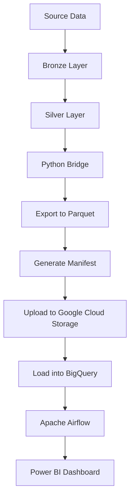
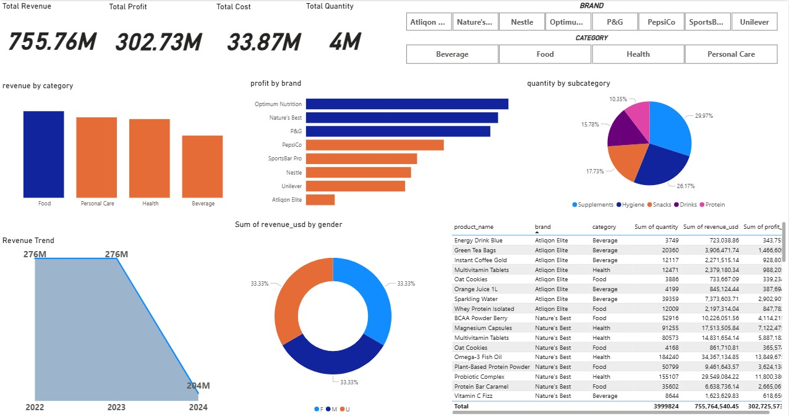

# 🏬 FMCG Enterprise Data Warehouse
### SQL Server • Python • Apache Airflow • Google BigQuery • Power BI


---

# 📌 Project Overview

This project demonstrates the design and implementation of an **Enterprise Data Warehouse** for a Fast-Moving Consumer Goods (FMCG) company using the **Medallion Architecture (Bronze → Silver → Gold)**.

The solution integrates data from two business entities:

- **Atliqon Parent**
- **SportsBar Acquired**

The project covers the complete modern data engineering workflow, from SQL Server data warehousing and transformation to automated extraction, cloud migration, orchestration, and business intelligence reporting.

---

# ✨ Key Features

- Enterprise Medallion Architecture
- SQL Server Data Warehouse
- Data Cleaning & Standardization
- Slowly Changing Dimension (SCD Type 2)
- Currency Normalization (USD)
- Streaming SQL Server Extraction
- Parquet File Generation
- Manifest & Metadata Generation
- Google Cloud Storage Integration
- Google BigQuery Loading
- Apache Airflow Orchestration
- Data Quality Validation
- Interactive Power BI Dashboard

---

# 🏗️ Solution Architecture



---

# 🔄 End-to-End Pipeline

```
Source Data
      │
      ▼
SQL Server
(Bronze Layer)
      │
      ▼
Silver Layer
      │
      ▼
Python Extraction
      │
      ▼
Parquet Files
      │
      ▼
Google Cloud Storage
      │
      ▼
Google BigQuery
      │
      ▼
Power BI Dashboard
```

---

# 📂 Repository Structure

```
FMCG-Data-Warehouse
│
├── README.md
├── requirements.txt
├── .gitignore
│
├── sql
│   └── fmcg_data_warehouse.sql
│
├── scripts
│   ├── config.py
│   ├── extract_silver_to_parquet.py
│   ├── upload_to_bigquery.py
│   └── run_pipeline.py
│
├── airflow
│   └── fmcg_bridge_dag.py
│
├── powerbi
│   └── DEPI.pbix
│
├── docs
│   └── Roadmap.pdf
│
└── tests
    ├── test_connection.py
    └── test_bridge.py
```

---

# ⚙️ Technology Stack

| Category | Technology |
|-----------|------------|
| Database | SQL Server |
| Data Warehouse | Medallion Architecture |
| ETL | T-SQL & Python |
| Data Processing | Pandas & PyArrow |
| Cloud Storage | Google Cloud Storage |
| Cloud Warehouse | Google BigQuery |
| Orchestration | Apache Airflow |
| BI & Visualization | Power BI |

---

# 🗄️ Data Warehouse Architecture

## 🥉 Bronze Layer

The Bronze Layer stores raw transactional data from both business entities without modifications.

**Schemas**

- bronze_parent
- bronze_acquired
- bronze_shared

---

## ⚪ Silver Layer

The Silver Layer applies business rules and data quality transformations.

### Implemented Transformations

- Data Cleaning
- Duplicate Removal
- Product Standardization
- Gender Normalization
- Currency Conversion
- Negative Profit Correction
- Slowly Changing Dimension Type 2
- Data Validation

---

## 🥇 Gold Layer

The Gold Layer is optimized for analytics and reporting.

Features include:

- Unified Sales Tables
- Materialized Fact Tables
- Optimized Dimensions
- Indexed Queries
- BI-ready Dataset

---

# 🐍 Python Bridge

The Python bridge automates the transfer of data from SQL Server to Google BigQuery.

Pipeline steps:

1. Connect to SQL Server
2. Extract Silver Layer
3. Stream data in batches
4. Validate schema
5. Export Parquet files
6. Generate metadata manifest
7. Upload to Google Cloud Storage
8. Load data into BigQuery

### Additional Features

- Memory-efficient streaming
- Batch processing
- Logging
- Schema enforcement
- SHA256 checksum generation
- Command-line execution
- Dry-run mode
- Incremental table processing

---

# ☁️ Google Cloud Integration

The cloud pipeline automatically:

- Uploads Parquet files to Google Cloud Storage
- Creates the BigQuery dataset (if missing)
- Loads Parquet files into BigQuery
- Supports Append and Overwrite modes

---

# 🌬️ Apache Airflow

The Airflow DAG automates the complete workflow.

Pipeline Tasks

1. Refresh SQL Server Silver Layer
2. Extract Silver tables
3. Generate Parquet files
4. Upload to Google Cloud Storage
5. Load into BigQuery
6. Validate row counts
7. Complete pipeline execution

---

# 📊 Power BI Dashboard

The Power BI dashboard provides interactive business insights including:

### Executive KPIs

- Total Revenue
- Total Profit
- Total Cost
- Total Quantity

### Sales Analytics

- Revenue by Category
- Profit by Brand
- Quantity by Subcategory
- Revenue Trend
- Revenue by Gender

### Interactive Filters

- Brand
- Category

### Product Performance

Detailed product-level analysis with:

- Quantity Sold
- Revenue
- Profit

---

## Dashboard Preview

```markdown

```

---

# 🚀 Running the Project

## Execute the complete pipeline

```bash
python run_pipeline.py
```

## Refresh Silver Layer before extraction

```bash
python run_pipeline.py --refresh-silver
```

## Extract only

```bash
python run_pipeline.py --extract-only
```

## Upload only

```bash
python run_pipeline.py --bq-only
```

## Overwrite BigQuery tables

```bash
python run_pipeline.py --overwrite
```

---

# 📈 Future Improvements

- dbt Integration
- Docker Support
- CI/CD Pipeline
- Incremental Loading
- Data Quality Framework
- Great Expectations
- Cloud Composer
- Terraform Deployment
- Monitoring Dashboard
- Data Catalog

---

# 📦 Requirements

Install the required packages:

```bash
pip install -r requirements.txt
```

---

# 👨‍💻 Author

**Yassa Saied**

**Mohamed Minyar**

**Alsayed Abdelsamei**

**Mohamed Elshabasy**

**Ali**

**Amr Alyamany**

**Technologies**

- SQL Server
- Python
- Apache Airflow
- Google BigQuery
- Google Cloud Storage
- Power BI
- Data Warehousing
- ETL Development

---

⭐ If you found this project useful, consider giving it a **Star** on GitHub!
